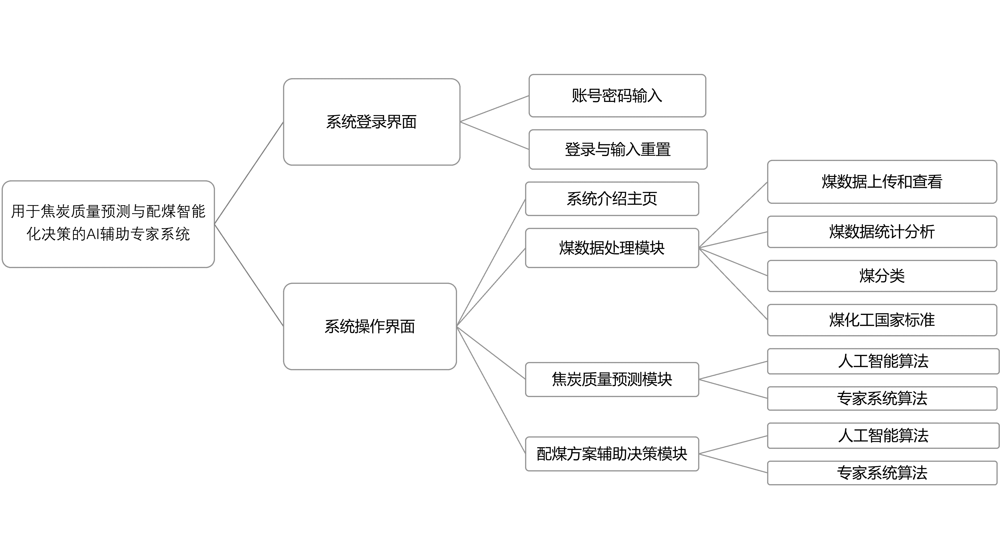

概述
====

我们的框架结合了 Vue.js 前端和基于 Python 的后端，并支持 MySQL 数据库，以提供无缝的 Web 应用体验。

我们设计此系统是为了通过现代 Web 技术促进用户与底层数据之间的高效、直观交互。该框架确保用户可以通过响应式和动态界面轻松导航、管理和操作数据库。

全栈框架
--------

系统的核心是 Vue.js 前端，它提供了一个响应式和基于组件的用户界面。Vue.js 具有灵活性和高性能，使应用程序能够根据用户交互和状态变化动态更新视图。

Python 后端由 Flask 或 Django 等框架支持，负责应用逻辑并作为前端与 MySQL 数据库之间的通信层。Python 提供了实现 RESTful API 或 GraphQL 服务的灵活性，从而实现高效的数据检索、处理和存储。

架构
----

前端: Vue.js
~~~~~~~~~~~~

Vue.js 前端处理表示逻辑。它根据用户输入和从后端获取的数据动态渲染用户界面。Vue 的基于组件的结构允许可重用的 UI 元素，使开发过程更加模块化和可维护。

主要功能包括：

- **响应式数据绑定**：确保界面与底层数据模型保持同步。
- **Vue 路由**：提供在应用程序不同视图之间的导航。
- **状态管理**：通过 Vuex 处理，实现对共享应用状态的集中控制。

后端: Python (Flask/Django)
~~~~~~~~~~~~~~~~~~~~~~~~~~~

Python 后端是前端与 MySQL 数据库之间的粘合层。它处理客户端请求、执行数据操作并将处理后的数据返回给前端。

主要职责包括：

- **API 服务**：创建和管理处理 Vue.js 前端数据请求的 RESTful API。
- **业务逻辑**：处理数据，应用应用逻辑，并确保操作的完整性。
- **数据库管理**：处理对 MySQL 数据库的查询、更新和数据检索。

数据库: MySQL
~~~~~~~~~~~~~

MySQL 数据库存储所有持久数据。它支持关系数据模型，提供快速可靠的查询能力。所有用户输入、记录和应用数据都安全地存储在这里。

主要数据库操作包括：

- **数据存储**：持久化存储用户生成的数据和系统管理的数据。
- **查询**：高效地检索后端 API 请求的数据。
- **数据关系**：通过外键和约束维护数据的关系完整性。

多级软件设计
--------------

我们的系统可扩展至前端、后端和数据库之间的不同交互级别。模块化设计确保每个组件（无论是 Vue.js 组件还是 Python API）都可以独立管理和扩展。

用户通过 Vue.js 界面执行各种任务，例如添加新记录、查看数据或运行查询。Vue.js 组件与后端 API 通信，而后端则处理数据并与 MySQL 数据库交互。

数据流
------

.. image:: ../_images/data_flow.png
   :alt: 数据流

1. **用户输入**：用户通过提交表单或执行操作与 Vue.js 前端交互。
2. **API 请求**：Vue.js 通过 API 请求将数据发送到 Python 后端。
3. **数据库查询**：后端处理数据并对 MySQL 数据库执行必要的查询。
4. **响应**：处理后的数据返回给前端，Vue.js 相应地更新用户界面。

输出与数据处理
----------------

用户交互和数据库查询的结果以清晰直观的界面返回给用户。根据具体需求，数据可以以 CSV 或 JSON 等多种格式进行可视化、编辑或导出。

该全栈框架为开发需要实时数据处理、用户交互和可扩展架构的现代 Web 应用提供了一个强大的解决方案。
